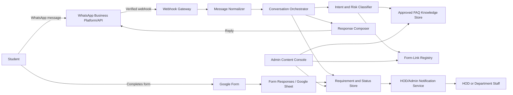

# System Design Product Requirements Document

## HOD WhatsApp Student Helpdesk Assistant

**Document status:** System design draft for implementation review  
**Version:** 1.0  
**Date:** 4 September 2026  
**Related product document:** WhatsApp Student Helpdesk Assistant PRD  
**Author:** Manus AI

## 1. Purpose

This document defines the system design requirements for a WhatsApp-based assistant that acts as the first-level student helpdesk for the Head of Department (HOD). The system will receive student messages, answer approved college and department queries, identify formal requirements, collect the necessary context, share a Google Form as the final step for formal requests, and route submitted cases to the HOD or authorized department staff.

The assistant is a support and routing system. It is not an autonomous authority and must not approve or reject academic, financial, disciplinary, examination, attendance, or grievance decisions.

## 2. Design Principles

The design follows five principles. First, **human authority remains with the HOD and authorized staff**. Second, **answers must be grounded in approved department content** rather than unrestricted generation. Third, **formal requests end with a Google Form handoff** so that student information is structured and reviewable. Fourth, **privacy and least-privilege access are mandatory**. Fifth, the system must degrade safely: when it is uncertain or unavailable, it should acknowledge the issue and provide a human or official-channel fallback.

## 3. Scope and System Boundary

### 3.1 In scope

The system includes an official WhatsApp Business Platform/API channel or authorized provider integration, inbound message handling, webhook verification, message normalization, intent classification, approved FAQ retrieval, conversation state management, Google Form-link selection, student guidance, form-submission tracking where available, HOD notifications, request status management, audit logging, operational monitoring, and administrator-managed FAQ and form configuration.

### 3.2 Out of scope

The system will not automate a personal WhatsApp account, access private WhatsApp conversations without an approved business integration, make official decisions, alter institutional records, provide confidential academic records, process payments, replace emergency services, or guarantee a response or approval. Direct integration with a student-information system is deferred unless the institution later approves the required access and data-sharing controls.

## 4. Assumptions and Dependencies

| Assumption or dependency | Design implication |
|---|---|
| The department will use an official WhatsApp Business Platform/API number or authorized provider. | The application can receive message events through a verified webhook and send replies through the provider API. The official WhatsApp platform documents webhooks for receiving events and API-based messaging [1]. |
| The department will provide approved FAQ content. | The assistant uses a controlled content store and does not invent policy answers. |
| The department will create one universal Google Form or multiple category forms. | A form registry maps request categories to current form URLs. Google Forms provides APIs for form and response resources [2]. |
| HOD or staff will review formal requests. | The system creates notifications and statuses but does not decide outcomes. |
| Students primarily use mobile devices. | Messages and forms must be short, mobile-friendly, and understandable without a desktop dashboard. |
| Institution-specific privacy and retention rules apply. | Final retention duration, access roles, and consent wording require institutional approval. |

## 5. High-Level Architecture

The system should be implemented as a webhook-driven service with a stateless application layer and durable storage for conversations, requirements, configurations, and audit events. A queue or durable job mechanism is recommended for notifications and retries so that a temporary provider or email failure does not cause message loss.

## 6. Logical Components

| Component | Responsibility | Key design requirements |
|---|---|---|
| WhatsApp adapter | Receives inbound events and sends outbound replies. | Provider-specific authentication, webhook verification, idempotency, rate-limit handling, and message status processing. |
| Webhook gateway | Validates the callback request and accepts events quickly. | Verify signature/token, reject invalid requests, return a fast acknowledgement, and enqueue work. |
| Message normalizer | Converts provider payloads into an internal message format. | Normalize sender ID, message ID, timestamp, text, media metadata, and conversation context. |
| Conversation orchestrator | Controls the conversation state and next action. | Persist state; support FAQ, clarification, formal requirement, form handoff, human escalation, and fallback paths. |
| Intent and risk classifier | Determines category, confidence, urgency, and escalation flags. | Use deterministic rules for keywords and risk plus a controlled classifier for ordinary language. |
| FAQ retrieval service | Finds approved answers and official links. | Return only currently published content with category, source, owner, and review date. |
| Form-link registry | Selects the correct Google Form link. | Support active/inactive links, category mapping, effective dates, and fallback universal form. |
| Requirement service | Creates and updates the student request record. | Generate a reference ID, deduplicate events, store status, and associate form response IDs where available. |
| Notification service | Alerts the HOD or administrator. | Retry delivery, prevent duplicate alerts, include concise summaries, and record delivery status. |
| Admin/content console | Manages FAQs, form links, contacts, and routing rules. | Role-based access, approval workflow, version history, and audit logging. |
| Observability service | Captures health, error, latency, and workflow metrics. | Avoid logging message content by default; support trace IDs and operational dashboards. |

## 7. Primary Data Flows

### 7.1 Incoming student message

The WhatsApp provider sends an event to the webhook gateway. The gateway verifies the request and checks whether the event ID has already been processed. A valid, new event is normalized and placed on a work queue. The conversation orchestrator loads or creates the conversation state, classifies the message, checks for risk or escalation triggers, retrieves an approved answer or form mapping, creates the next state, and sends a reply through the WhatsApp adapter. The inbound event, action, provider message ID, and outcome are recorded in the audit trail.

### 7.2 FAQ response

For an ordinary question, the classifier assigns an FAQ category and confidence score. The retrieval service returns the current approved content. The response composer produces a concise answer with the official link or contact when applicable. If confidence is below the configured threshold or no active answer exists, the system asks a clarifying question or offers the formal Google Form and human-review path.

### 7.3 Formal requirement and form handoff

For a formal requirement, the orchestrator confirms the category, collects a short description and minimum context, creates a preliminary request record, and sends the correct Google Form link. The final message must clearly state that the student must complete the form for the requirement to be formally recorded. A form response trigger, periodic synchronization, or staff confirmation can associate the submitted form with the preliminary request using a reference ID or student identifiers.

### 7.4 Escalation to the HOD

If the message is sensitive, urgent, ambiguous, explicitly requests the HOD, or concerns an official decision, the risk classifier sets an escalation flag. The system avoids giving a definitive decision, sends the student the approved escalation wording and form link, and notifies the HOD or responsible staff. The notification contains the reference ID, category, urgency, timestamp, student contact identifier subject to access policy, summary, and link to the full authorized record.

## 8. Conversation State Machine

| State | Entry condition | System action | Exit condition |
|---|---|---|---|
| New | First message from a student. | Send welcome and category guidance. | Student asks a question or selects a category. |
| Understanding | Message received but intent is not fully known. | Ask one concise clarifying question. | Intent is classified or user requests human help. |
| FAQ Answering | Supported routine query with adequate confidence. | Retrieve and send approved answer. | Answer sent; offer further help. |
| Requirement Intake | Formal request category detected. | Collect minimum context and create provisional request. | Context collected or escalation required. |
| Form Pending | Formal requirement is ready for submission. | Share the correct Google Form link. | Student submits form, returns with confirmation, or abandons. |
| Human Review | Sensitive, urgent, unknown, or explicitly escalated issue. | Notify HOD/staff and send transparent handoff message. | Staff takes over, requests more information, or closes case. |
| Closed | Request resolved or conversation inactive under policy. | Retain record according to policy; permit new conversation later. | New inbound message creates or reopens a conversation. |

## 9. Internal API Requirements

The following interfaces are logical contracts. Exact paths and authentication methods may vary by implementation.

| Interface | Method and purpose | Minimum input | Minimum output |
|---|---|---|---|
| Provider webhook | `POST /webhooks/whatsapp` | Provider event payload, signature, event ID. | Fast acknowledgement and queued processing result. |
| Send message | `POST /internal/messages/send` | Conversation ID, recipient ID, message type, body, correlation ID. | Provider message ID and delivery state. |
| Classify message | `POST /internal/classify` | Text, conversation state, active categories. | Intent, confidence, risk flags, urgency, next action. |
| Retrieve FAQ | `GET /internal/faqs/search` | Query, category, locale. | Approved answer, source link, version, confidence. |
| Resolve form link | `GET /internal/forms/resolve` | Category, department, current date. | Active form URL, form version, required instructions. |
| Create requirement | `POST /internal/requirements` | Student contact ID, category, summary, source message ID. | Reference ID and initial status. |
| Update requirement | `PATCH /internal/requirements/{id}` | Status, staff note, assigned reviewer. | Updated status and audit event ID. |
| Form synchronization | `POST /internal/forms/responses/sync` | Form response ID or provider event. | Matched requirement, match status, and timestamp. |
| Health check | `GET /health` | None. | Service, dependency, and version status. |

All internal endpoints must authenticate service-to-service calls, validate input schemas, use correlation IDs, and avoid returning unnecessary personal data.

## 10. Data Model

### 10.1 Core entities

| Entity | Important fields | Notes |
|---|---|---|
| StudentContact | `id`, provider contact ID, phone hash or tokenized ID, consent state, created time, last-seen time | Store the minimum identifier required for messaging and matching. |
| Conversation | `id`, student contact ID, state, locale, last message time, assigned reviewer, closed time | Stores current workflow state and routing information. |
| Message | `id`, provider message ID, conversation ID, direction, type, redacted text or content reference, timestamp, delivery state | Provider message ID must be unique for idempotency. |
| Requirement | `id`, reference ID, conversation ID, category, summary, form URL/version, form response ID, status, urgency, assigned reviewer, timestamps | Represents a formal student request. |
| FAQEntry | `id`, category, question patterns, approved answer, official URL, locale, status, owner, version, review date | Only published entries may be used in replies. |
| FormConfig | `id`, category, URL, instructions, status, effective dates, owner, version | Prevents use of retired or incorrect forms. |
| Notification | `id`, requirement ID, recipient, channel, event type, delivery state, retry count, timestamps | Supports reliable HOD alerts. |
| AuditEvent | `id`, actor type, actor ID, action, entity type, entity ID, timestamp, correlation ID | Must not contain full sensitive message content by default. |

### 10.2 Example requirement status values

`NEW`, `FORM_PENDING`, `SUBMITTED`, `UNDER_REVIEW`, `NEED_MORE_INFORMATION`, `ESCALATED`, `RESOLVED`, and `CLOSED`.

## 11. Google Form Design and Correlation

The preferred first-release approach is to use a Google Form for formal collection and a restricted response destination for staff review. The form should include student name, register number, department, year/semester, mobile number, request category, subject, detailed requirement, urgency, supporting-document field where necessary, preferred response method, and consent/declaration.

To associate a response with the WhatsApp conversation, the form should include a prefilled or manually entered reference ID when the selected Google Forms configuration supports that workflow. If a reference ID cannot be passed safely, the matching process may use a combination of student register number, phone number, category, and submission time, with ambiguous matches sent for manual review. Google Forms API support for form and response resources should be validated against the institution’s selected account and authorization model before implementation [2].

## 12. Security and Privacy Requirements

The system must use HTTPS for all external and internal network communication. Webhook authenticity must be verified according to the selected WhatsApp provider. API secrets, signing keys, and Google credentials must be stored in a secret manager or protected environment configuration and must never be committed to source control or written to ordinary logs.

Role-based access control must separate system administration, FAQ editing, form configuration, request review, and HOD decision-making. A department administrator may review operational requests, while only authorized institutional personnel may access sensitive cases. Google Form responses and any uploaded files must use restricted sharing and least-privilege permissions.

The system must minimize personal-data collection, provide a clear purpose statement, restrict retention to the institution’s approved period, support deletion or anonymization where required, and maintain an audit trail of access and status changes. Students must be warned not to send passwords, payment credentials, or unrelated sensitive information through chat.

## 13. AI and Classification Controls

The classification layer may use rules, a constrained language model, or both. Risk and policy rules must take precedence over ordinary intent classification. The assistant must not answer from general model knowledge when the question concerns institution-specific policy unless a matching approved FAQ entry exists.

The system should use confidence bands. High-confidence routine FAQs may be answered automatically. Medium-confidence cases should receive a clarifying question. Low-confidence, sensitive, or high-impact cases must receive the safe fallback and human escalation. Classification output should include intent, confidence, risk flags, language, and recommended action so that decisions are auditable.

## 14. Reliability and Failure Handling

The webhook endpoint should acknowledge valid events quickly and process them asynchronously. Every external event requires idempotency protection based on provider event or message ID. Outbound messages and notifications must use retry with bounded backoff. Permanent failures should enter a dead-letter queue or equivalent review list.

If the WhatsApp provider is unavailable, the system should preserve accepted events and retry delivery. If the FAQ store is unavailable, the assistant should send a short fallback directing the student to the official department contact or form. If the Google Form link is unavailable, the system must not send a stale or unverified link; it should notify staff and provide a human-review path.

## 15. Observability and Operations

The system should produce structured operational logs containing timestamp, component, severity, correlation ID, provider event ID, request reference ID, and error code. Message bodies and form answers should be excluded or redacted by default. Operational metrics should include webhook acceptance rate, processing latency, outbound delivery rate, retry count, classifier fallback rate, FAQ answer rate, form handoff count, form completion count where available, escalation count, and notification latency.

Alerts should be configured for repeated webhook failures, provider authentication errors, high outbound failure rates, growing queues, unavailable dependencies, expired form configurations, and notification failures. A daily or weekly operational report should show unresolved requirements and failed handoffs to the HOD or administrator.

## 16. Deployment Requirements

For a production service that must respond to incoming WhatsApp events, the application requires an always-available HTTPS endpoint. A managed web application with an event handler is the preferred first implementation when the workload fits within its runtime limits. If a continuously running worker or near-real-time process is required, use an always-on managed hosting mode. A separate cloud computer is only justified if the implementation requires custom operating-system packages, Docker, fixed network controls, or resources beyond the managed application limits.

The deployment should have separate development, staging, and production configurations. Production must use a verified domain or HTTPS endpoint, protected environment variables, database backups, provider webhook configuration, Google authorization, and an operational contact. Releases should be versioned and reversible.

## 17. Configuration Requirements

The following values must be configurable without changing core workflow code:

| Configuration | Examples |
|---|---|
| Department identity | Department name, institution name, HOD display name. |
| Support hours | Start/end time, working days, out-of-hours message. |
| FAQ content | Questions, answers, official links, locale, review dates. |
| Request categories | Certificates, attendance, exam issues, leave, project, complaint, appointment. |
| Form mapping | Category-to-form URL, instructions, active dates. |
| Escalation rules | Sensitive categories, urgency keywords, HOD request phrases. |
| Notification routing | HOD, administrator, backup reviewer, channel. |
| Retention | Conversation, requirement, audit, and file retention periods. |
| Language | Supported response languages and fallback language. |

## 18. Testing Requirements

Testing must cover provider webhook verification, duplicate events, malformed payloads, message ordering, retries, rate limits, FAQ retrieval, incorrect and ambiguous classifications, form-link selection, out-of-hours handling, human escalation, unauthorized access, notification failures, and data-retention behavior.

A representative acceptance suite should include simple FAQs, formal requirements, messages in supported languages, incomplete student details, sensitive cases, unknown questions, explicit requests to speak to the HOD, and repeated submissions. Staff should review generated answers before pilot launch, and no production rollout should occur until every active form link is verified.

## 19. Security and Operational Acceptance Criteria

The system is ready for pilot when the WhatsApp webhook accepts only verified events, duplicate provider events do not create duplicate requirements, all outbound messages can be traced to a conversation, active FAQ answers have an owner and review date, formal requests end with the correct Google Form link, form responses are visible only to authorized staff, HOD notifications are retried and audited, sensitive requests are escalated without automated decisions, and service failure produces a safe fallback rather than fabricated information.

## 20. Open Implementation Decisions

Before development begins, the department must select the official WhatsApp provider, confirm the phone number and account owner, choose the deployment environment, provide Google Workspace authorization, decide between one universal form and category-specific forms, define notification recipients, approve privacy and retention language, provide the FAQ source, select supported languages, and decide whether an administrator dashboard is required in version 1.

## References

[1]: https://developers.facebook.com/documentation/business-messaging/whatsapp/webhooks/overview "Meta for Developers: WhatsApp Webhooks"

[2]: https://developers.google.com/workspace/forms/api/reference/rest "Google Forms API Reference"
